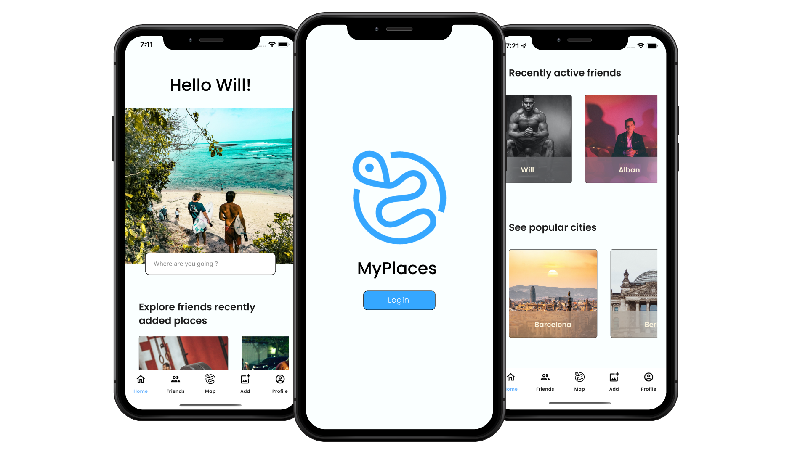
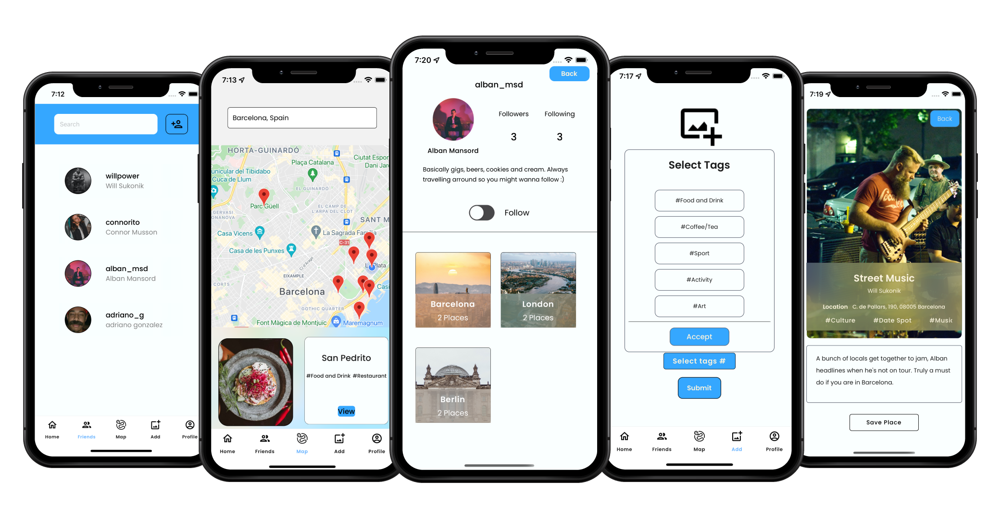

# MyPlaces - Share your favorite places with friends.
([MyPlaces Backend](https://github.com/alban44980/places-server))

 

MyPlaces is an app for people who believe the recommendation of a friend is more valuable than that of a stranger.

No longer will people have to send large notes and messages for recommended places. Just say 'Add me on MyPlaces'. 

 

So what is a Place? A Place is exactly that. A Place anywhere in the world that is recommended, created either by the current user or another user. Each Place has an image, description, location and relevant tags (such as nature, food and drink, or music), so you can search for and find exactly what you are looking for. Users can signup and create a personal account and profile page. Once logged in, if you have friends already, you will be able to view a list of friends, cities and their Places, as well as a search functionality. From here, users can search based a specific city, filtering by friend or tags and view all the available Places.

The map feature populates the map with the location of your friends Places based on your current location. With the ability to search over the world. When selected, each place displays a preview of the Place and its related tags.

 

Places can be added or removed from the users SavedPlaces list at anytime. Accessible on the Profile page, so the best recommendations are never missed or never forgotten. 

A user can easily view their friends list and add/remove friends at any time.

 

Finally, the user can add their own Place or Places, anywhere in the world that they recommend. Simply upload an image, description, location with relevant tags. Other users can now search your profile and follow you to see your places.

Enjoy!

## Table of Contents:

[MyPlaces Frontend](https://github.com/alban44980/places-client)
[Tech Stack](#tech-stack)  
[Running MyPlaces](#running-myplaces)  
[Developers Team](#developers-team)  

## Tech Stack
### Front-end

### Backend

## Authentication

<ul>
  <li>JWT</li>
  <li>bCrypt</li>
</ul>

## The client

- Fork & clone this repo
- Run npm i in the Places directory
- Adjust the necessary env variables to match your system (You will need an API key for the Google Autocomplete as well as the map)
- Make sure to have Expo installed on your machine (npm install --global expo-cli)
- On your phone, download the Expo app.
- Run npm start from the terminal, and scan the QR code from your expo app, the app will start running on your phone (you also have the option to use a simulator such as Xcode if you prefer)
